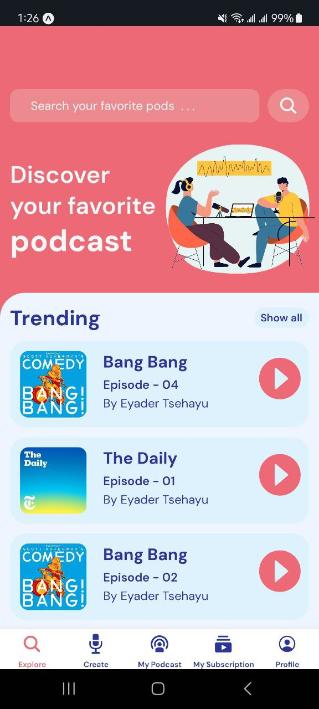
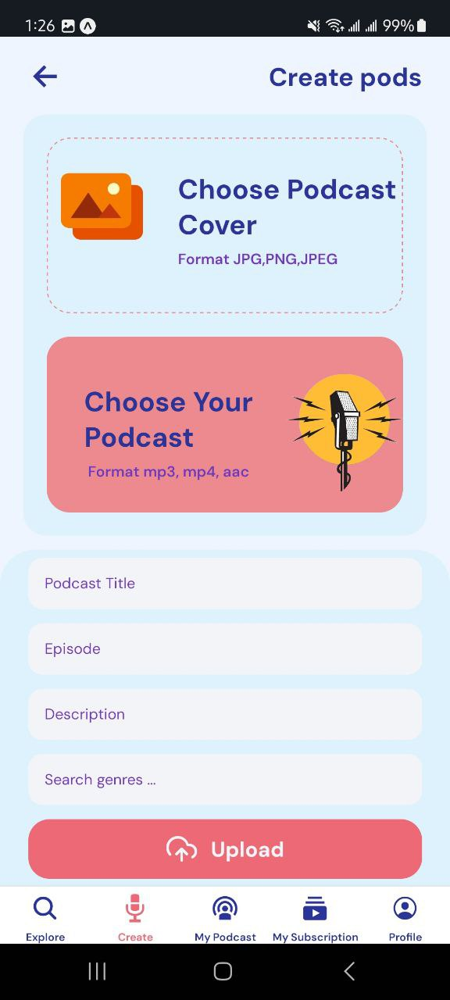
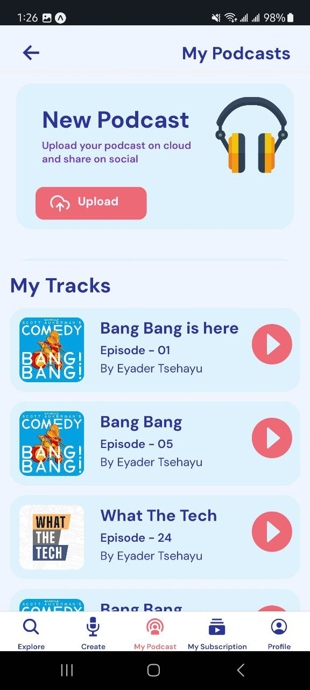
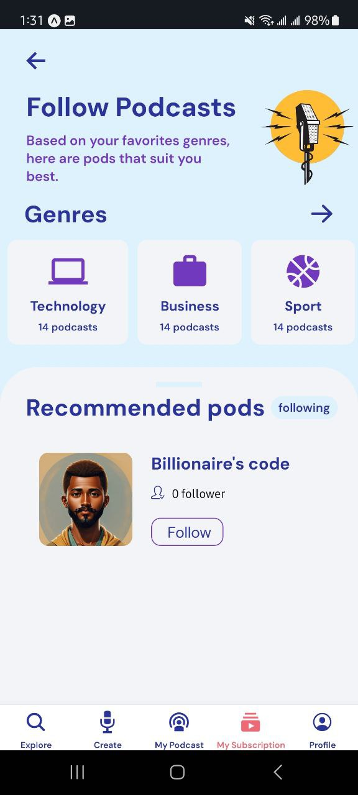
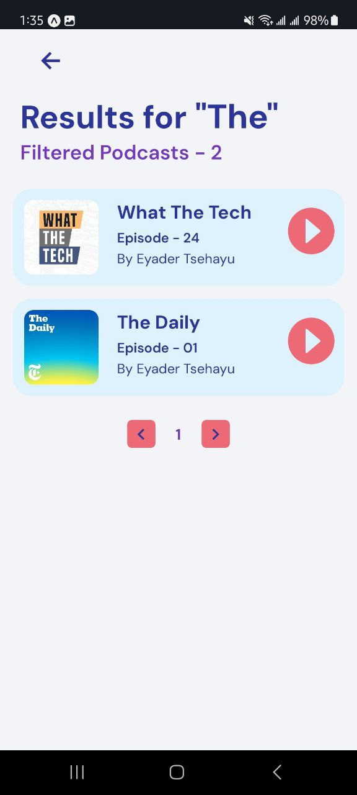
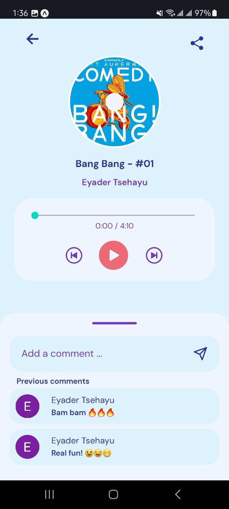
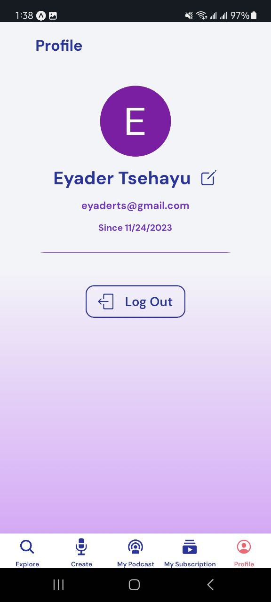

# Habeshan pods 
### Unleash Your Ears, Ignite Your Mind

Habeshan pod is a state-of-the-art mobile application built with React Native and powered by Firebase, offering an immersive podcast listening experience.Dive into the world of podcasts, subscribe to your favorites, leave comments, like, share, and more.

## Screenshots 📷

&nbsp;&nbsp;&nbsp;
&nbsp;&nbsp;&nbsp;
&nbsp;&nbsp;&nbsp;

 
&nbsp;&nbsp;&nbsp;
&nbsp;&nbsp;&nbsp;
&nbsp;&nbsp;&nbsp;

## Technologies ⚛️
 - `React Native`
 - `Firebase`
 - `Typescript`
 - `clerk`
 - `expo`

## Features

- **User Authentication with Clerk:** Securely log in and personalize your podcast experience with Clerk authentication.

- **Explore and Discover Podcasts:** Browse a vast library of podcasts to find your favorite shows or discover new and exciting content.

- **Subscribe and Unsubscribe:** Easily subscribe to your preferred podcasts to receive the latest episodes. Unsubscribe whenever you wish.

- **Interactive Features:**
  - **Comment:** Engage with the podcast community by leaving comments on your favorite episodes.
  - **Like:** Show appreciation for outstanding content by liking episodes.
  - **Share:** Share your favorite episodes with friends and family through various social media platforms.

- **Firebase Integration:** Leverage the power of Firebase for real-time database, authentication, and cloud functions, ensuring a robust and scalable backend.

- **Expo Framework:** Utilize the Expo framework for rapid development, testing, and deployment of your React Native app.

## Setup / Installation 💻

1. Clone the repository: `https://github.com/EyaderTsehayu/Habeshan-Pod.git`
2. Navigate to the project directory: `cd Habeshan-Pod`
3. Install dependencies: `npm install`
4. Set up Firebase: Replace the Firebase configuration in `/firebaseConfig.js` with your own credentials.
5. Set up Clerk: Update Clerk settings with your Clerk API key.

## Usage

1. Run the app: `npm start`
2. Use Expo to test the app on your local machine or deploy it to your preferred mobile device.

## Feedback
I welcome your feedback! If you have any suggestions, issues, or feature requests, please open an issue on our [GitHub repository](https://github.com/EyaderTsehayu/Habeshan-Pod/issues).

## License
This project is licensed under the [MIT License](LICENSE).

## Author 📝
- Eyader Tsehayu(eyaderts@gmail.com)

---

Thank you for choosing Podcastify! Enjoy subscribing, commenting, liking, sharing, and making your podcast experience truly interactive.
